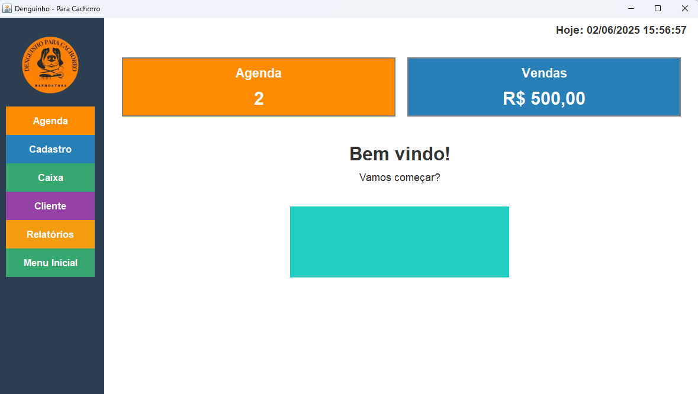
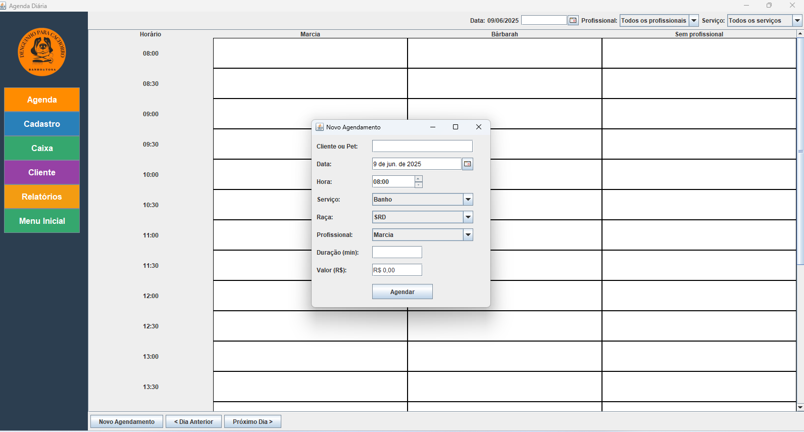
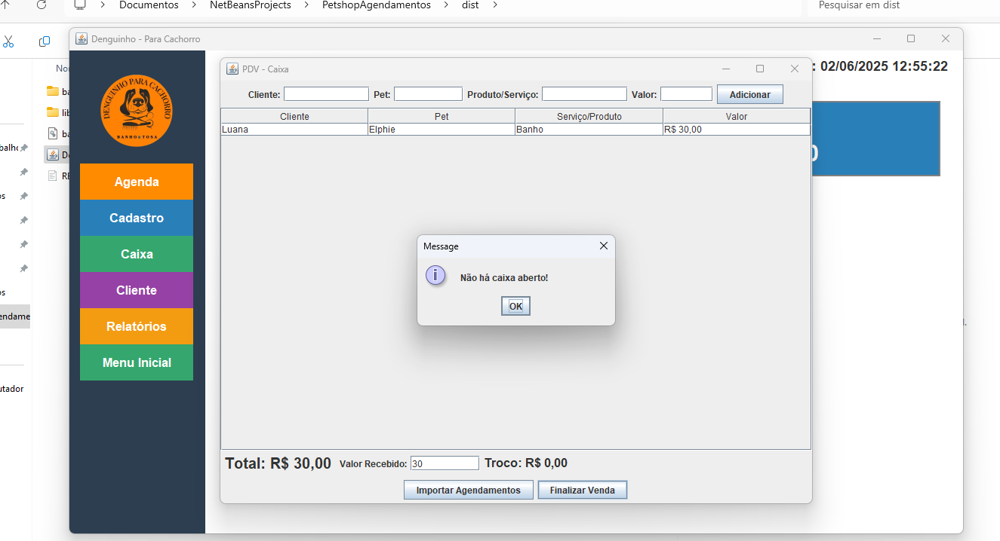
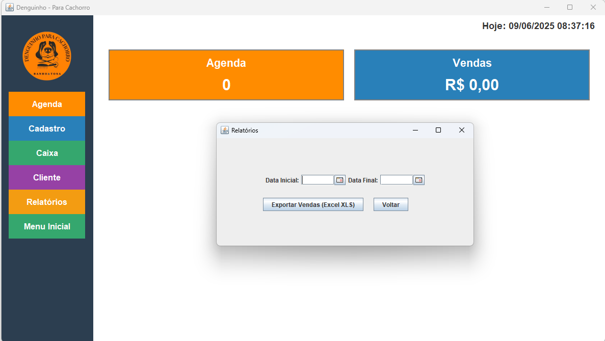
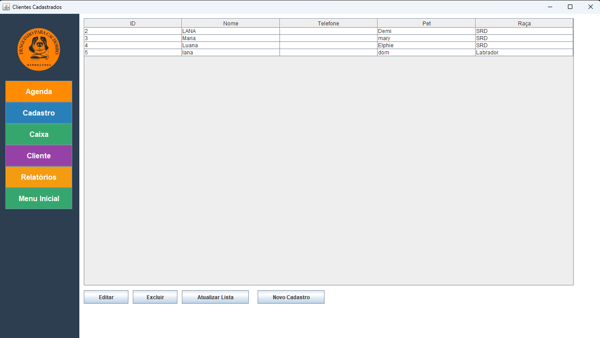

# Sistema de Agendamento Denguinho 🐶

Sistema de agendamento desenvolvido em Java com Swing e SQLite para controle de atendimentos em petshops.

## Funcionalidades

- 🗓 **Agendamento de serviços** para pets com visualização diária estilo grade;
- 👩‍💼 Controle de **profissionais** e **tipos de serviço**;
- 💸 Tela de **caixa** com baixa automática dos valores agendados;
- 📊 Geração de **relatórios**;
- 📁 Cadastro completo de **clientes e pets**;
- 🖥 Interface moderna e intuitiva com foco na praticidade.

## Tecnologias

- Java (Swing)
- SQLite
- NetBeans IDE

## Telas do Sistema

### Tela Inicial
Exibe o resumo do dia com total de agendamentos e vendas realizadas.



---

### Agenda Diária
Agenda no estilo grade com horários, profissionais e serviços, possibilitando visualização e filtragem por data, profissional e tipo de serviço.



---

### Tela do Caixa
Permite registrar pagamentos com base nos agendamentos realizados.




---

### Tela de relatórios
Permite puxar o historios de vendas e agendamentos em excel com base na data escolhida.




---

### Clientes Cadastrados
Tela de gerenciamento de clientes, exibindo uma lista com os dados do tutor e do pet (nome, telefone, pet e raça).
Permite editar, excluir, atualizar a lista ou realizar um novo cadastro.
O menu lateral facilita a navegação para outras áreas do sistema, como agenda, caixa e relatórios.



## Como Executar

1. Clone o repositório:
   ```bash
   git clone https://github.com/luanascutti/SistemaAgendamentoDenguinho.git
